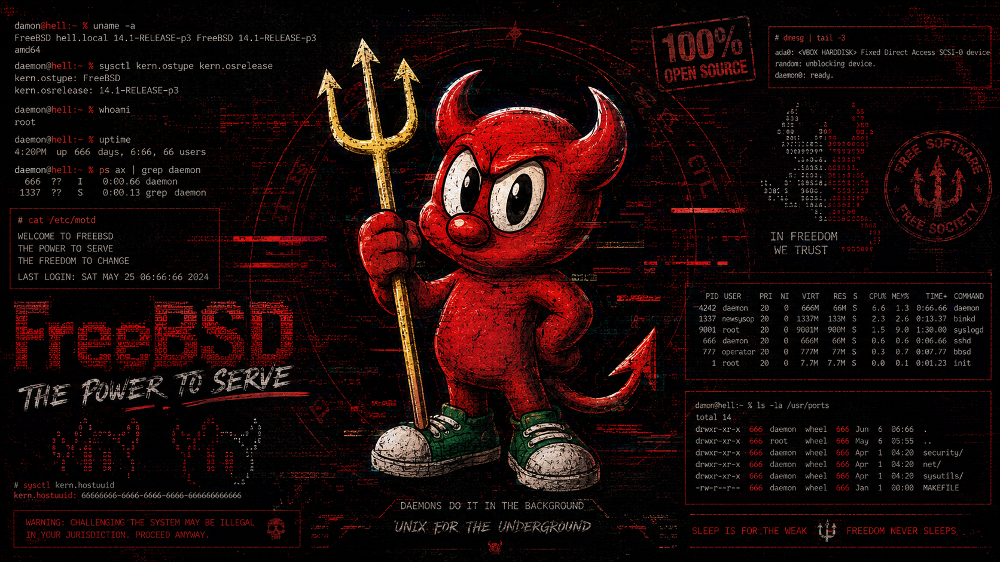
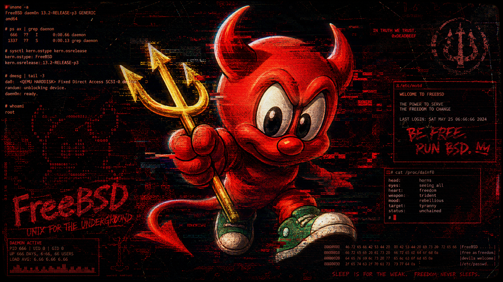
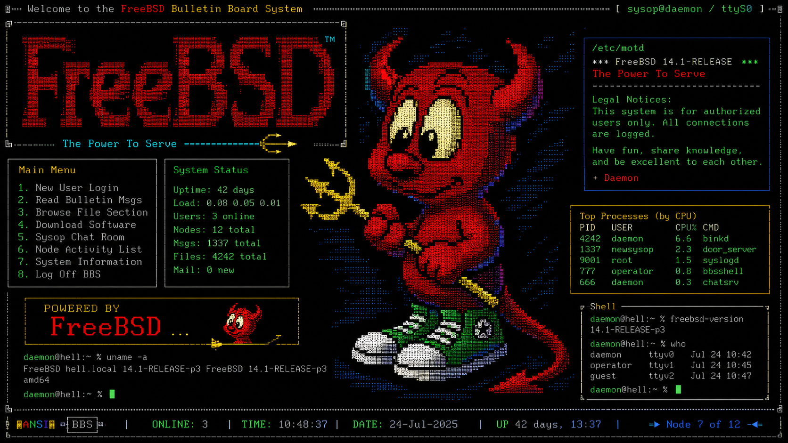
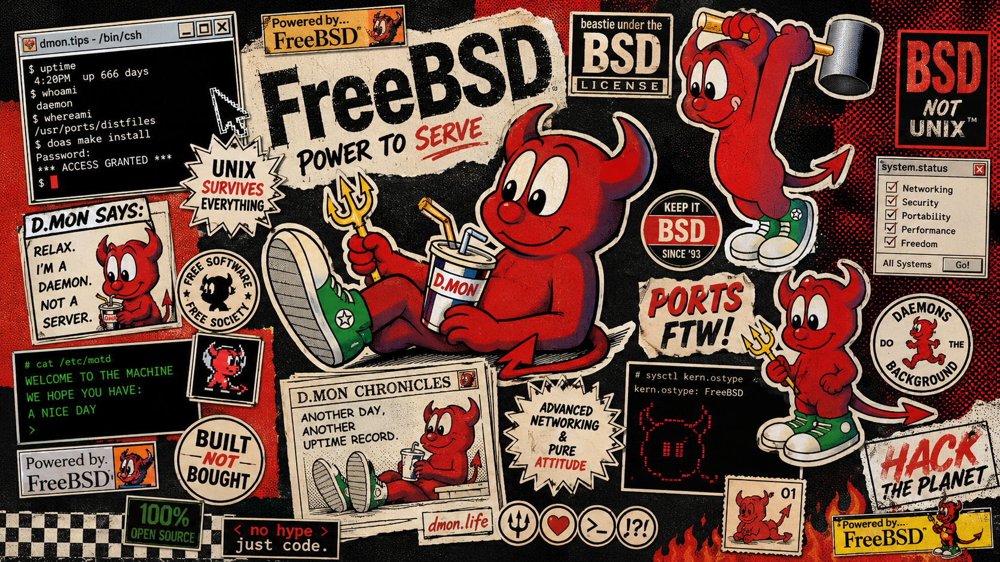

# wallpaper

A curated archive of hacker-adjacent wallpapers, including AI-generated, AI-assisted, remixed, downloaded, and community-inspired material.

## Table of Contents

* [Overview](#overview)
* [Repository Stats](#repository-stats)
* [Categories](#categories)
* [Disclaimer](#disclaimer)
* [Attribution and Takedown](#attribution-and-takedown)
* [Why This Exists](#why-this-exists)
* [Gallery](#gallery)
  * [ccc](#ccc)
  * [cli](#cli)
  * [dedsec-style](#dedsec-style)
  * [freebsd](#freebsd)
  * [haltman](#haltman)
  * [inferigang](#inferigang)
  * [phrack](#phrack)
  * [thc](#thc)
* [Contributing](#contributing)
* [License and Usage](#license-and-usage)

## Overview

This repository exists as a public wallpaper archive for security, hacker, terminal, and related technical-community themes. The collection is intentionally simple: images are grouped by category under `dump/`, and this README acts as the browsable index.

Counts include `.png` wallpaper files under `dump/<category>/` only. Miscellaneous files, archives, executables, and non-wallpaper assets are excluded from the totals.

## Repository Stats

| Metric | Value |
|---|---:|
| Wallpapers | 84 |
| Categories | 8 |
| Primary format | PNG |
| Gallery root | `dump/` |
| License | [The Unlicense](LICENSE) |

## Categories

| Category | Wallpapers | Folder | Notes |
|---|---:|---|---|
| [ccc](#ccc) | 8 | `dump/ccc/` | Unofficial AI-generated CCC-inspired set. |
| [cli](#cli) | 13 | `dump/cli/` | Terminal and command-line themed wallpapers. |
| [dedsec-style](#dedsec-style) | 7 | `dump/dedsec-style/` | AI-generated or AI-remixed DedSec-style material. |
| [freebsd](#freebsd) | 4 | `dump/freebsd/` | Unofficial AI-generated FreeBSD fan material. |
| [haltman](#haltman) | 9 | `dump/haltman/` | Haltman wallpaper set. |
| [inferigang](#inferigang) | 14 | `dump/inferigang/` | Mix of original group wallpapers and unofficial additions. |
| [phrack](#phrack) | 17 | `dump/phrack/` | Unofficial AI-generated Phrack fan material. |
| [thc](#thc) | 12 | `dump/thc/` | THC-themed wallpaper set. |

## Disclaimer

### AI and unofficial material

Unless a section explicitly says otherwise, wallpapers in this repository may be AI-generated, AI-assisted, remixed, adapted, downloaded, upscaled, or inspired by existing images, logos, styles, community art, or public internet material.

Anything referencing a real project, community, logo, mascot, magazine, team, company, or organization is unofficial fan material. It is not official material, not endorsed, not approved, and not affiliated with those projects or organizations.

### Authorship

I do not claim original authorship over material that comes from, references, or depends on someone else's artwork, identity, logo, style, community, or visual language. AI generation or AI-assisted editing does not make me the original artist of the underlying subject matter.

## Attribution and Takedown

If artwork from someone else appears anywhere in this repository and that person wants credit, send an email to root@haltman.io with the filename and the requested attribution.

Takedown requests are welcome at the same address. Send the filename and the reason, and I will remove the file or update the attribution as appropriate.

## Why This Exists

Searching for usable wallpapers often leads to low-quality images, watermarks, unrelated image dumps, or generic stock material. This repository is a practical archive of wallpapers I would actually use and want to keep available.

## Gallery

Click a preview to open the original file.

### ccc

| | | |
|---|---|---|
|  <code>CCC-UNOFFICIAL-AIgenerated-001.png</code> |  <code>CCC-UNOFFICIAL-AIgenerated-002.png</code> |  <code>CCC-UNOFFICIAL-AIgenerated-003.png</code> |
|  <code>CCC-UNOFFICIAL-AIgenerated-004.png</code> |  <code>CCC-UNOFFICIAL-AIgenerated-005.png</code> |  <code>CCC-UNOFFICIAL-AIgenerated-006.png</code> |
|  <code>CCC-UNOFFICIAL-AIgenerated-007.png</code> |  <code>CCC-UNOFFICIAL-AIgenerated-008.png</code> |  |

### cli

| | | |
|---|---|---|
|  <code>cli-wallpaper-001.png</code> |  <code>cli-wallpaper-002.png</code> |  <code>cli-wallpaper-003.png</code> |
|  <code>cli-wallpaper-004.png</code> |  <code>cli-wallpaper-005.png</code> |  <code>cli-wallpaper-006.png</code> |
|  <code>cli-wallpaper-007.png</code> |  <code>cli-wallpaper-008.png</code> |  <code>cli-wallpaper-009.png</code> |
|  <code>cli-wallpaper-010.png</code> |  <code>cli-wallpaper-011.png</code> |  <code>cli-wallpaper-012.png</code> |
|  <code>cli-wallpaper-013.png</code> |  |  |

### dedsec-style

**Set note:** Phrack-related attribution and Call for Arts boundaries also apply to `dedsec-style-001.png` and `dedsec-style-005.png`. These are AI-generated or AI-remixed wallpaper attempts, not official Phrack art, not original artwork by me, and not material that should be treated as a Call for Arts submission. If a real artist made the source material behind any of these images, credit and takedown requests can be sent to root@haltman.io.

| | | |
|---|---|---|
|  <code>dedsec-style-001.png</code> |  <code>dedsec-style-002.png</code> |  <code>dedsec-style-003.png</code> |
|  <code>dedsec-style-004.png</code> |  <code>dedsec-style-005.png</code> |  <code>dedsec-style-006.png</code> |
|  <code>dedsec-style-007.png</code> |  |  |

### freebsd

**Set note:** These FreeBSD wallpapers are AI-generated unofficial fan-made material. They are not official FreeBSD Project material, not endorsed by the FreeBSD Project or the FreeBSD Foundation, and should not be presented as official artwork.

| | | |
|---|---|---|
|  <code>freebsd-UNOFFICIAL-ai-generated-001.png</code> |  <code>freebsd-UNOFFICIAL-ai-generated-002.png</code> |  <code>freebsd-UNOFFICIAL-ai-generated-003.png</code> |
|  <code>freebsd-UNOFFICIAL-ai-generated-004.png</code> |  |  |

### haltman

| | | |
|---|---|---|
|  <code>haltman-wallpaper-001.png</code> |  <code>haltman-wallpaper-002.png</code> |  <code>haltman-wallpaper-005.png</code> |
|  <code>haltman-wallpaper-006.png</code> |  <code>haltman-wallpaper-007.png</code> |  <code>haltman-wallpaper-008.png</code> |
|  <code>haltman-wallpaper-009.png</code> |  <code>haltman-wallpaper-010.png</code> |  <code>haltman-wallpaper-011.png</code> |

### inferigang

**Set note:** Most of these Inferigang wallpapers are originals from the group itself. I downloaded them after they were shared in the Rootkit Researchers Discord community. I did not create those originals; this repository only preserves them in the archive.

| | | |
|---|---|---|
|  <code>inferigang-original-001.png</code> |  <code>inferigang-original-002.png</code> |  <code>inferigang-original-003.png</code> |
|  <code>inferigang-original-004.png</code> |  <code>inferigang-original-005.png</code> |  <code>inferigang-original-006.png</code> |
|  <code>inferigang-original-007.png</code> |  <code>inferigang-original-008.png</code> |  <code>inferigang-original-009.png</code> |
|  <code>inferigang-unofficial-001.png</code> |  <code>inferigang-unofficial-002.png</code> |  <code>inferigang-unofficial-003.png</code> |
|  <code>inferigang-unofficial-004.png</code> |  <code>inferigang-unofficial-005.png</code> |  |

### phrack

**Phrack / Call for Arts note:** I sent a heads-up email to arts@phrack.org making it clear that every wallpaper in this Phrack section was generated by AI. I also made it clear that I do not want any of these to be considered, in any way, as material for their Call for Arts.

This note exists to prevent these files from being submitted or represented as original human-made artwork. Real Call for Arts submissions should come from the artists who created them.

**Source note:** `phrack-UNOFFICIAL-ai-generated-wallpaper-016.png` and `phrack-UNOFFICIAL-ai-generated-wallpaper-017.png` used to be `haltman-wallpaper-003.png` and `haltman-wallpaper-004.png`. I found the source image on Phrack's X profile. The original was cropped, so I used AI only to extend it to full HD in 16:9 so it could work as a wallpaper. I did not create the original art for those images.

| | | |
|---|---|---|
|  <code>phrack-UNOFFICIAL-ai-generated-wallpaper-001.png</code> |  <code>phrack-UNOFFICIAL-ai-generated-wallpaper-002.png</code> |  <code>phrack-UNOFFICIAL-ai-generated-wallpaper-003.png</code> |
|  <code>phrack-UNOFFICIAL-ai-generated-wallpaper-004.png</code> |  <code>phrack-UNOFFICIAL-ai-generated-wallpaper-005.png</code> |  <code>phrack-UNOFFICIAL-ai-generated-wallpaper-006.png</code> |
|  <code>phrack-UNOFFICIAL-ai-generated-wallpaper-007.png</code> |  <code>phrack-UNOFFICIAL-ai-generated-wallpaper-008.png</code> |  <code>phrack-UNOFFICIAL-ai-generated-wallpaper-009.png</code> |
|  <code>phrack-UNOFFICIAL-ai-generated-wallpaper-010.png</code> |  <code>phrack-UNOFFICIAL-ai-generated-wallpaper-011.png</code> |  <code>phrack-UNOFFICIAL-ai-generated-wallpaper-012.png</code> |
|  <code>phrack-UNOFFICIAL-ai-generated-wallpaper-013.png</code> |  <code>phrack-UNOFFICIAL-ai-generated-wallpaper-014.png</code> |  <code>phrack-UNOFFICIAL-ai-generated-wallpaper-015.png</code> |
|  <code>phrack-UNOFFICIAL-ai-generated-wallpaper-016.png</code> |  <code>phrack-UNOFFICIAL-ai-generated-wallpaper-017.png</code> |  |

### thc

| | | |
|---|---|---|
|  <code>thc-wallpaper-001.png</code> |  <code>thc-wallpaper-002.png</code> |  <code>thc-wallpaper-003.png</code> |
|  <code>thc-wallpaper-004.png</code> |  <code>thc-wallpaper-005.png</code> |  <code>thc-wallpaper-006.png</code> |
|  <code>thc-wallpaper-007.png</code> |  <code>thc-wallpaper-008.png</code> |  <code>thc-wallpaper-009.png</code> |
|  <code>thc-wallpaper-010.png</code> |  <code>thc-wallpaper-011.png</code> |  <code>thc-wallpaper-012.png</code> |

## Contributing

Add wallpapers through a pull request.

When adding or removing wallpapers:

* Put wallpaper images under `dump/<category>/`.
* Count only `.png` wallpaper files in the badges, stats table, and category table.
* Update the category entry, gallery section, and table of contents when adding a new category.
* Add a short set note when a category is unofficial, AI-generated, AI-assisted, remixed, or based on third-party material.
* Keep filenames descriptive and scoped to the category.

## License and Usage

This repository uses [The Unlicense](https://unlicense.org/). As far as this repository controls the material, it is released into the public domain for free use, remixing, redistribution, and personal or community use.

### Do not claim false authorship

Use the files, remix them, fork the repository, print them, or put them on your desktop. Do not publicly claim that you personally created artwork that you did not create.

### Respect original creators

The license and usage notes do not limit the original authors, projects, communities, or organizations whose work, logos, styles, or identities made some of this material possible. If you are an original rights holder or representative and want credit, changes, or removal, contact root@haltman.io.

> *extencil@segfault.net*
> *June, 2026*
